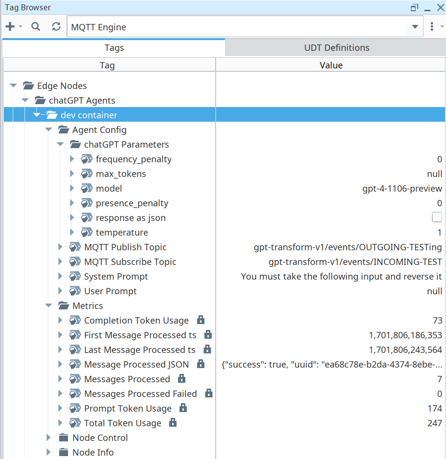

# chatGPTAgent
Connect ChatGPT to an MQTT Broker
# Overview
This container is conceptualized to function as a part of a UNS, connecting to an MQTT Broker as both a consumer and producer of events/information. For config and monitoring purposes, it acts as a Sparkplug Edge Node, although the actual topics it subscribes to and publishes chatGPT tranformations to can be any valid MQTT topic, and do not follow the sparkplug protocol. A key benefit of this arcitecture is that if the MQTT Broker feeds into a data lake, it becomes easy to track chatGPT, and analyze the performance/accuracy/etc of different prompts and settings.

It subscribes to a specified MQTT topic (/Agent Config/MQTT Subscribe Topic), processes incoming messages using a specified ChatGPT model (/Agent Config/chatGPT Parameters/*) and prompt (/Agent Config/System Prompt, /Agent Config/User Prompt), and then publishes the results to a specified publish topic (/Agent Config/MQTT Publish Topic). The container can be used independently or orchestrated in a sequence where one instance's output becomes the input for the next, enabling complex step by step data transformations. Another setup could be having 1 container manipulate the prompt settings of another (Via ignition scripting or similar), etc.

ChatGPT is not necessarily suitable for doing basic data transformations that are purely mathmatical or those could otherwise be easily handled by a script/function. The idea for this is more to transform data from human input to computer input, and computer input to human input, or to make descisions / decide next action based on some given context. The example use case that sparked this whole project is the automation of purchasing for fab shop, specifically when shop employees send requests to a purchasing slack channel.

# Configuration

## Environment Variables
The application is configured using environment variables. Note that GPT_MODEL, GPT_SYSTEM_PROMPT, GPT_USER_PROMPT, MQTT_SUBSCRIBE_TOPIC, MQTT_PUBLISH_TOPIC will be ignored after the first start up of the container, because by design the container will look to use whatever values have been saved to disk before using the environment variables. They are also not required to start the container, but will need to be configured via NCMD for the container to work.

- DEBUG: value of "true", "True", or "1" will set log level to debug. Optional.
- OPENAI_API_KEY: Your OpenAI API Key.
- GPT_MODEL: GPT model to use, default is gpt-4-1106-preview. Optional.
- GPT_SYSTEM_PROMPT: The prompt for message processing.
- GPT_USER_PROMPT: Optional user prompt added to incoming messages.
- MQTT_SUBSCRIBE_TOPIC: MQTT topic to subscribe to.
- MQTT_PUBLISH_TOPIC: MQTT topic to publish results to.
- MQTT_HOST: MQTT Broker Address/IP.
- MQTT_PORT: Port for MQTT, typically 1883 or 8883 for SSL.
- MQTT_USE_TLS: Set to true or false for SSL usage.
- MQTT_USERNAME: Your MQTT username.
- MQTT_PASSWORD: Your MQTT password.
- MQTT_CLIENT_ID: MQTT Client ID, auto set if empty.
- SPARKPLUG_GROUP_ID: Sparkplug group ID, defaults to "chatGPT Agents".
- SPARKPLUG_EDGE_NODE_ID: Sparkplug Edge node ID, defaults to MQTT_CLIENT_ID if not supplied.
- DATA_DIRECTORY: Directory for persistent data files inside the container, default is "/etc/sparkplug/<SPARKPLUG_GROUP_ID>/<SPARKPLUG_EDGE_NODE_ID>/".
- CONFIG_FILEPATH: File for persistent edge node config inside the container, default is "<DATA_DIRECTORY>config.json".
- MEMORY_TAGS_FILEPATH: File for persistent memory tag data inside the container, default is "<DATA_DIRECTORY>memory-tags.json".

## The Metrics/Tags

This screenshot of the tags from the MQTT Engine in Ignition show the tag structure of the container:

The following config tags are directly used in the parameters when calling of the openai.ChatCompletion.create function:
- Agent Config/chatGPT Parameters/frequency_penalty --> https://platform.openai.com/docs/api-reference/chat/create#chat-create-frequency_penalty
- Agent Config/chatGPT Parameters/max_tokens --> https://platform.openai.com/docs/api-reference/chat/create#chat-create-max_tokens
- Agent Config/chatGPT Parameters/model --> https://platform.openai.com/docs/api-reference/chat/create#chat-create-model
- Agent Config/chatGPT Parameters/presence_penalty --> https://platform.openai.com/docs/api-reference/chat/create#chat-create-presence_penalty
- Agent Config/chatGPT Parameters/response as json --> https://platform.openai.com/docs/api-reference/chat/create#chat-create-response_format
- Agent Config/chatGPT Parameters/temperature --> https://platform.openai.com/docs/api-reference/chat/create#chat-create-temperature

The following config tags are used for the settings of the gpt agent container:
- Agent Config/MQTT Publish Topic --> The topic to publish the content result of the openai.ChatCompletion.create function
- Agent Config/MQTT Subscribe Topic --> The topic to subscribe to that triggers and payload is given to the openai.ChatCompletion.create function
- Agent Config/System Prompt --> The required system (role=system) prompt by which chatGPT is instructed on how to process the incoming payloads from the MQTT Subscribe Topic
- Agent Config/User Prompt --> The optional user (role=user) prompt to put in front of the incoming payloads from the MQTT Subscribe Topic

The following tags are performance metrics of the container:
- Metrics/Completion Token Usage --> The total number of completion tokens used since the first message processed
- Metrics/First Message Processed ts --> The timestamp in milliseconds when the first message was processed by the container
- Metrics/Last Message Processed ts --> The timestamp in milliseconds that the most recent message received was processed by the container
- Metrics/Message Processed JSON
- - Testing
- Metrics/Messages Processed --> The count of total messages processed by the container since the first message processed
- Metrics/Messages Processed Failed --> The count of total messages that were failed to be processed by the container since the first message processed
- Metrics/Prompt Token Usage --> The total number of prompt tokens used since the first message processed
- Metrics/Total Token Usage --> The total number of tokens used since the first message processed

# Planned Updates
## Multiple Agents per Container
